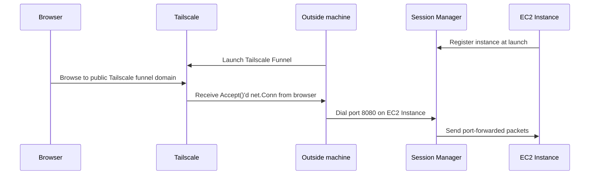

# `freedata`

This is a silly little project that gives you free egress (I think? Someone fact-check
that, please) from your webapp-hosting EC2 instances via AWS Systems Manager
Session Manager and Tailscale. Session Manager streams are limited to about
10mbit.

## Usage

Why are you using this? Don't.

```
# run this somewhere with cheap egress, e.g. outside AWS
go build
./freedata i-instanceid 8080 # if your web app is listening on port 8080
```

## How it works

Here's a really half-baked sequence diagram. 


